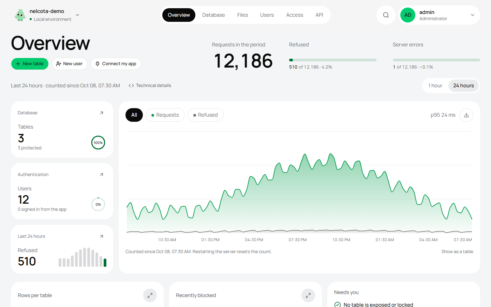
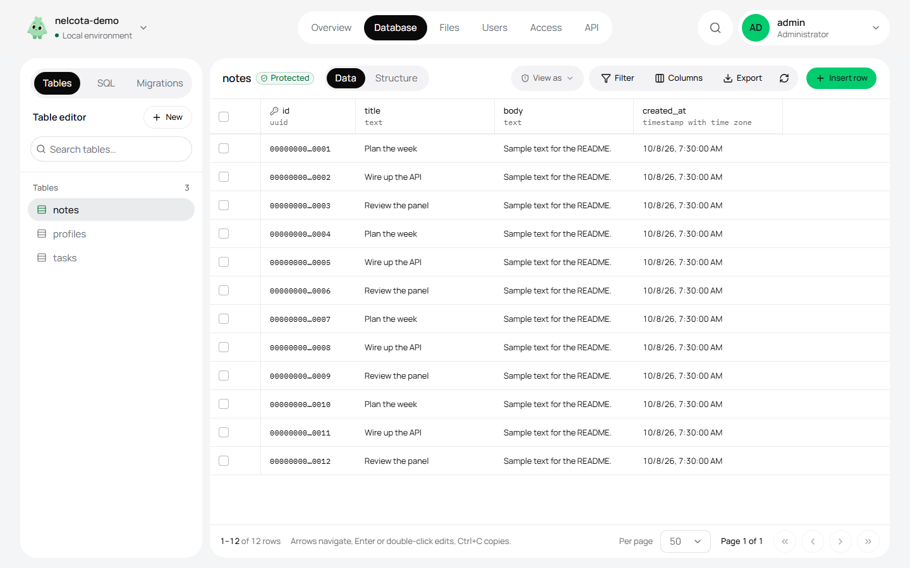

<div align="center">


# Nelcota

**Open source backend-as-a-service, simple and lock-in free.**<br>
Plain Postgres + one Rust binary + a 5-minute deploy on a VPS.

[](https://github.com/HanielCota/Nelcota/actions/workflows/ci.yml)
[](https://github.com/HanielCota/Nelcota/releases/latest)
[](LICENSE)


[Quickstart](docs/quickstart.md) · [Deploy](docs/deploy.md) · [REST API](docs/api.md) · [Panel](docs/panel.md) · [Docs](#documentation) · [nelcota.com](https://nelcota.com)

</div>

<br>

<picture>
  <source media="(prefers-color-scheme: dark)" srcset="docs/assets/panel-overview-dark.png">
  
</picture>

## Why Nelcota

- **Postgres is the product.** Schema, RLS policies and functions are plain SQL
  and keep working without Nelcota.
- **Authorization belongs to RLS.** The API only validates the JWT and assumes
  its role inside a transaction. It never decides permissions on its own.
- **One binary, everything included.** REST, auth, storage, an admin panel and
  a deploy CLI, with nothing else to run beside Postgres.
- **Open standards.** JWT/JWKS, PHC argon2id, OAuth 2.0 + PKCE, plain SQL,
  OpenAPI, S3-compatible. You can leave and take everything with you
  ([leaving.md](docs/leaving.md)).

## What's inside

| | |
| --- | --- |
| **REST API** | Generated from your schema: filters, ordering, writes, RPC and OpenAPI at `/rest/v1/` ([api.md](docs/api.md)) |
| **Auth** | EdDSA JWT + JWKS, argon2id, refresh with rotation, password recovery, email confirmation, magic link, sign-in with Google or GitHub ([jwt-and-roles.md](docs/jwt-and-roles.md)) |
| **Storage** | Files under the same RLS policies, bytes on disk or in any S3 bucket, signed URLs ([storage.md](docs/storage.md)) |
| **Admin panel** | Table editor with inline editing, SQL editor with autocomplete, users, RLS policies, files and migrations generated from panel changes, in English and Portuguese ([panel.md](docs/panel.md)) |
| **Deploy CLI** | Fresh VPS to HTTPS, several isolated projects per server, backups and point-in-time recovery ([deploy.md](docs/deploy.md)) |
| **SDKs** | [`@nelcota/client`](sdk/typescript/README.md) for JavaScript/TypeScript and [`nelcota-client`](sdk/rust/README.md) for Rust, plus generated types |

## Deploy: fresh VPS → HTTPS

```sh
curl -fsSL https://nelcota.com/install | sh
nelcota init api.yourdomain.com
nelcota up
```

**Several projects on the same VPS**, each one isolated (Postgres, users, keys,
backups), with its own domain or a subdomain and a single sign-on for every
panel:

```sh
nelcota init api.shop.com                              # own domain
nelcota init --project blog --base-domain example.com  # subdomain: blog.example.com
nelcota up && nelcota projects
```

<details>
<summary><b>Backups, point-in-time recovery and running without Docker</b></summary>

<br>

Backup and restore are in [docs/backup.md](docs/backup.md), including
point-in-time recovery (`nelcota -p shop pitr enable`: WAL archived to S3,
restore to any second).

A VPS that holds a single project can skip Docker: `nelcota init <domain>
--runtime systemd` installs Postgres and Caddy from apt and runs the app as a
systemd unit.

</details>

**New here?** The [local development quickstart](docs/quickstart.md) goes from
install to `nelcota dev`, a migration, generated types and the SDK in a few
minutes. Something not working? See [troubleshooting](docs/troubleshooting.md).

## Usage in 1 minute

**1. Write a table and its policy in plain SQL.**

```sql
-- migrations/V1__notes.sql  →  nelcota migrate
CREATE TABLE public.notes (
    id    bigint GENERATED ALWAYS AS IDENTITY PRIMARY KEY,
    owner uuid NOT NULL DEFAULT auth.uid(),
    body  text NOT NULL
);
ALTER TABLE public.notes ENABLE ROW LEVEL SECURITY;
CREATE POLICY owner ON public.notes FOR ALL TO authenticated
    USING (owner = auth.uid()) WITH CHECK (owner = auth.uid());
GRANT SELECT, INSERT, UPDATE, DELETE ON public.notes TO authenticated;
```

**2. Sign up and use the API.** Every request runs under RLS as that user.

```sh
# sign up → session; keep its access token and user id (requires jq)
SESSION=$(curl -s -X POST https://api.yourdomain.com/auth/v1/signup \
  -H 'content-type: application/json' -d '{"email":"ana@x.com","password":"strong-password-123"}')
TOKEN=$(echo "$SESSION" | jq -r .access_token)
USER_ID=$(echo "$SESSION" | jq -r .user.id)
# With email confirmation on, sign-up returns no session: confirm the email, then sign in
# with POST '/auth/v1/token?grant_type=password' and the same body to get one.

# CRUD under RLS
curl -X POST https://api.yourdomain.com/rest/v1/notes -H "authorization: Bearer $TOKEN" \
  -H 'content-type: application/json' -H 'prefer: return=representation' -d '{"body":"hi"}'
curl "https://api.yourdomain.com/rest/v1/notes?body=ilike.*hi*&order=id.desc" -H "authorization: Bearer $TOKEN"
```

**3. Store files under the same policies.** Each file is a row in
`storage.objects`, its bytes on disk or in any S3 bucket
([storage.md](docs/storage.md)).

```sh
curl -X POST "https://api.yourdomain.com/storage/v1/object/avatars/$USER_ID/me.png" \
  -H "authorization: Bearer $TOKEN" -H 'content-type: image/png' --data-binary @me.png
```

> [!WARNING]
> A JWT with `role: service_role` bypasses all RLS. Never expose it in the frontend.

## Clients and types

- **JavaScript / TypeScript:** [`@nelcota/client`](sdk/typescript/README.md),
  with sessions, OAuth and storage. Start with its
  [quickstart](docs/quickstart.md) (also in
  [Portuguese](sdk/typescript/docs/quickstart.pt-BR.md)) and the runnable
  browser/Node examples, which share [examples/notes.sql](examples/notes.sql).
  Generated schema types are optional for JavaScript:
  `nelcota types -o database.ts`.
- **Rust:** [`nelcota-client`](sdk/rust/README.md), with Tokio, sessions, OAuth
  and streaming storage. Generate models with
  `nelcota types --lang rust -o database.rs`.
- **Anything else:** plain HTTP, described by OpenAPI at `/rest/v1/`.

## The panel

Served at `/admin/` by the same binary. Light and dark, in English and
Portuguese (picked from the browser, switchable in the account menu).

<picture>
  <source media="(prefers-color-scheme: dark)" srcset="docs/assets/panel-table-dark.png">
  
</picture>

## Development

Requirements: stable Rust and Docker.

```sh
cargo run -- dev            # Postgres 17 in a container + server at http://127.0.0.1:8000
cargo test                  # integration tests start a real Postgres 17 (testcontainers)
cargo clippy --all-targets -- -D warnings && cargo fmt --all --check
cargo audit && cargo deny check
./scripts/acceptance.sh --local   # init + up + HTTPS + migrate + backup/restore + rollback

# panel (Svelte 5 + shadcn-svelte + Tailwind v4 + CodeMirror)
cd crates/admin/ui && npm install && npm run dev
```

`dev` prints the panel URL and generated admin login; credentials persist in
`.nelcota/dev.env`. Existing development environments are upgraded automatically.

<details>
<summary><b>Working on the panel</b></summary>

<br>

The panel build (`crates/admin/ui/dist`) is versioned: compiling the binary
does not need Node.

For hot reload, run the panel command in a second terminal and open
`http://127.0.0.1:5173/admin/`. Vite proxies the API to `http://127.0.0.1:8000`;
set `NELCOTA_API_URL` to use another server address.

After changing panel wire types, run `npm run contracts` in `crates/admin/ui`.
Rust generates TypeScript and JSON Schema; Node compiles browser validators
without runtime `eval`. `cargo test` detects stale contracts. Run `npm run check`,
`npm test`, `npx playwright install chromium`, `npm run test:e2e` and
`npm run build` for panel changes. Browser regressions are also checked in CI.

</details>

<details>
<summary><b>What the tests prove</b></summary>

<br>

Against a real Postgres: a user cannot read or change another user's data
(with every verb), invalid, expired or unknown-role JWTs get 401, role and
claims do not leak between pooled requests, malicious identifiers and values
do not become SQL, and reusing a refresh token kills the session.

</details>

Contributions are welcome: see [CONTRIBUTING.md](CONTRIBUTING.md) and, for
vulnerabilities, [SECURITY.md](SECURITY.md).

## Documentation

| Getting started | Building | Operating | Design |
| --- | --- | --- | --- |
| [Quickstart](docs/quickstart.md) | [REST API](docs/api.md) | [Deploy](docs/deploy.md) | [Architecture](docs/architecture.md) |
| [Troubleshooting](docs/troubleshooting.md) | [Storage](docs/storage.md) | [Backup](docs/backup.md) | [Decisions](docs/decisions.md) |
| [Panel](docs/panel.md) | [JWT and roles](docs/jwt-and-roles.md) | [Leaving Nelcota](docs/leaving.md) | [Benchmark](bench/README.md) |
| | [Auth schema](docs/schema-auth.md) | | |

## Roadmap

Not in the MVP yet: realtime, Edge Functions, MFA, image transformations and
multi-tenant. The architecture leaves room for them.

## License

[Apache-2.0](LICENSE)
